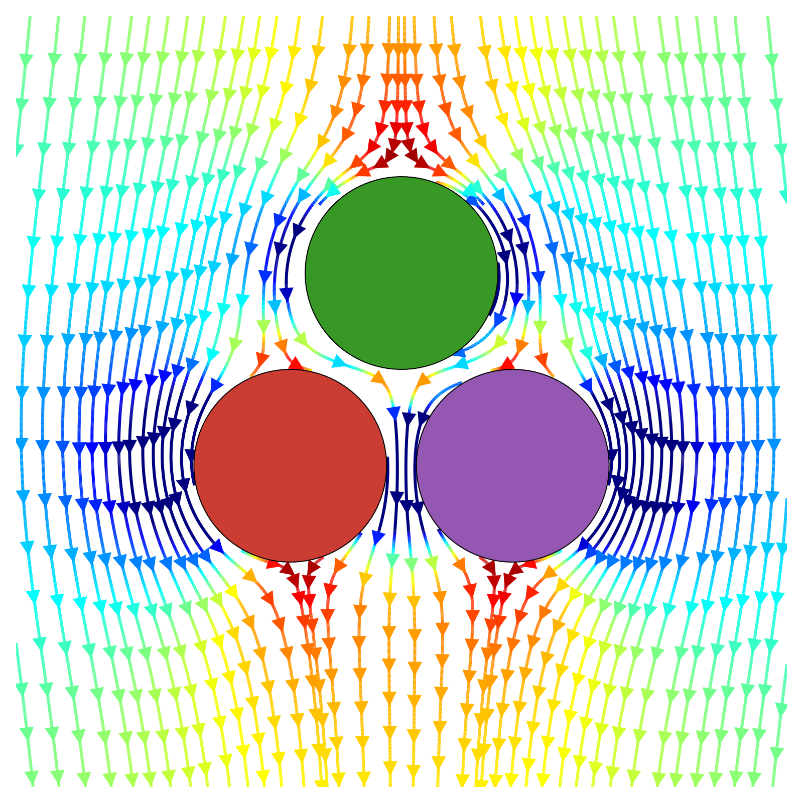

# UniformStreamlines.jl

[](https://antoniosgeme.github.io/UniformStreamlines.jl/stable)
[](https://antoniosgeme.github.io/UniformStreamlines.jl/dev)
[](https://github.com/antoniosgeme/UniformStreamlines.jl/actions/workflows/Test.yml?query=branch%3Amain)
[](https://codecov.io/gh/antoniosgeme/UniformStreamlines.jl)
[](https://github.com/antoniosgeme/UniformStreamlines.jl/actions/workflows/Docs.yml?query=branch%3Amain)
[](https://github.com/JuliaBesties/BestieTemplate.jl)


<p align="center">
  
</p>


Evenly-spaced streamlines for 2-D, 3-D, and N-D vector fields in Julia, using the Jobard–Lefer algorithm. Works with function-defined or grid-defined velocity fields, with built-in support for Plots.jl and Makie.jl.

## Installation

```julia
using Pkg
Pkg.add("https://github.com/antoniosgeme/UniformStreamlines.jl.git")
```

## Quick Start

```julia
using UniformStreamlines

xs = LinRange(-2, 2, 200)
ys = LinRange(-2, 2, 200)

# From functions
str = stream(xs, ys, (x, y) -> -y, (x, y) -> x)

# From matrices
U = [-y for x in xs, y in ys]
V = [ x for x in xs, y in ys]
str = stream(xs, ys, U, V)
```

Plot with Plots.jl:

```julia
using Plots
streamlines(str)
```

Or with Makie:

```julia
using CairoMakie
streamlines(str)
```

<p align="center">
  
</p>

## Features

### Density Control

```julia
# Sparse streamlines
str = stream(xs, ys, (x, y) -> -1 - x^2 + y, (x, y) -> 1 + x - y^2;
             min_density=2, max_density=4)

# Dense streamlines
str = stream(xs, ys, (x, y) -> -1 - x^2 + y, (x, y) -> 1 + x - y^2;
             min_density=5, max_density=15)
```


### Color-Mapping

```julia
str = stream(xs, ys, (x, y) -> sin(π*x) * cos(π*y), (x, y) -> 0.2y)
c = colorize(str, :speed)

# Plots.jl
streamlines(str; line_z=c, color=:viridis)
```

Built-in color symbols: `:speed`, `:vx`, `:vy`, `:vz`, `:x`, `:y`, `:z`, or pass any `(pos, vel) -> scalar` function.

<p align="center">
  
</p>

### NaN Masking

Return `NaN` to mask regions — streamlines stop at boundaries:

```julia
u(x, y) = (x+1)^2 + y^2 < 1 ? NaN : x + y
v(x, y) = (x+1)^2 + y^2 < 1 ? NaN : x - y
str = stream(xs, ys, u, v)
```

<p align="center">
  
</p>

### Seed Points

```julia
str = stream(xs, ys, (x, y) -> x + y, (x, y) -> x - y;
             seeds=([-1.0, 0.0, 1.0], [0.0, 0.0, 0.0]))
```

<p align="center">
  
</p>

### Unbroken Streamlines

```julia
str = stream(xs, ys, (x, y) -> -y / (x^2 + y^2 + 0.1),
                     (x, y) ->  x / (x^2 + y^2 + 0.1);
             allow_collisions=true)
```

<p align="center">
  
</p>

### 3-D

```julia
xs = LinRange(-2, 2, 50); ys = LinRange(-2, 2, 50); zs = LinRange(-2, 2, 50)
str3 = stream(xs, ys, zs, (x,y,z) -> -y, (x,y,z) -> x, (x,y,z) -> 0.3z)
```

ABC flow with arrows and speed coloring:

```julia
A, B, C = 1.0, √2, √3
str3 = stream(xs, ys, zs,
              (x,y,z) -> A*sin(z) + C*cos(y),
              (x,y,z) -> B*sin(x) + A*cos(z),
              (x,y,z) -> C*sin(y) + B*cos(x);
              min_density=2, max_density=4)
c3 = colorize(str3, :speed)
streamlines(str3; color=c3, colormap=:magma,
            with_arrows=true, arrows_every=25, markersize=0.12)
```

<p align="center">
  
</p>

### N-D (Tuple Form)

```julia
axs = ntuple(_ -> LinRange(-2, 2, 50), 4)
fns = ((x,y,z,t) -> -y, (x,y,z,t) -> x, (x,y,z,t) -> z, (x,y,z,t) -> -t)
str4 = stream(axs, fns)
```

## API

| Function | Description |
|:---------|:------------|
| `stream` | Compute evenly-spaced streamlines |
| `colorize` | Compute per-point color values |
| `streamarrows` | Extract arrow glyphs for visualization |
| `streamlines` / `streamlines!` | Plot recipe (Plots.jl or Makie) |

See the [documentation](https://antoniosgeme.github.io/UniformStreamlines.jl/stable) for full details.

