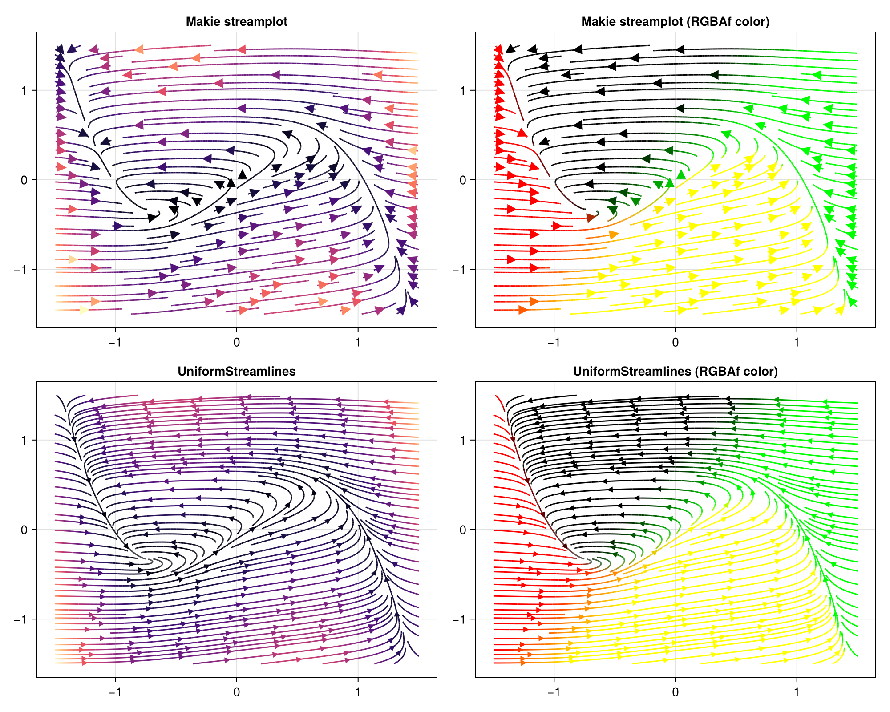

# Examples

## FitzHugh–Nagumo Model

The [FitzHugh–Nagumo model](https://en.wikipedia.org/wiki/FitzHugh%E2%80%93Nagumo_model) is a
simplified model of neuronal excitability. Its phase-plane dynamics are described by the system

$$\dot{v} = \frac{v - w - v^3 + s}{\varepsilon}, \qquad \dot{w} = \gamma v - w + \beta,$$

where $v$ is the membrane potential, $w$ is a recovery variable, and
$(\varepsilon, s, \gamma, \beta)$ are parameters.

```julia
using UniformStreamlines
using CairoMakie

struct FitzhughNagumo{T}
    ϵ::T
    s::T
    γ::T
    β::T
end

# Two-argument form used internally; single-argument wrapper passed to evenstream
f(x, P::FitzhughNagumo) = Point2f(
    (x[1] - x[2] - x[1]^3 + P.s) / P.ϵ,
     P.γ * x[1] - x[2] + P.β,
)

P = FitzhughNagumo(0.1, 0.0, 1.5, 0.8)
f(x) = f(x, P)

str = evenstream(-1.5:1.5, -1.5:1.5, f, min_density = 3, max_density = 7)
```

`f` returns a `Point2f`, which is an `SVector` — so there are zero allocations per integration
step. See the [performance note](index.md#Function-or-Matrix-Input) for details.

### Visualization

The four panels below compare Makie's built-in `streamplot` with `UniformStreamlines`.
The bottom row uses [`colorize`](@ref) to colour the lines by speed (`:norm`) and by velocity
direction (custom `RGBAf` function):

```julia
fig = Figure(size = (1000, 800))

# Row 1 — Makie streamplot
ax11 = Axis(fig[1, 1], title = "streamplot (:magma)")
streamplot!(ax11, f, -1.5..1.5, -1.5..1.5, colormap = :magma)

ax12 = Axis(fig[1, 2], title = "streamplot (RGBAf color)")
streamplot!(ax12, f, -1.5..1.5, -1.5..1.5, color = p -> RGBAf(p..., 0.0, 1.0))

# Row 2 — UniformStreamlines
c      = colorize(str, :norm)
colors = colorize(str, (p, v) -> RGBAf(v[1], v[2], 0.0, 1.0))

ax21 = Axis(fig[2, 1], title = "UniformStreamlines (:norm → :magma)")
streamlines!(ax21, str; color = c, colormap = :magma, with_arrows = true, arrows_spacing = 0.4)

ax22 = Axis(fig[2, 2], title = "UniformStreamlines (RGBAf color)")
streamlines!(ax22, str; color = colors, with_arrows = true, arrows_spacing = 0.4)

fig
```


