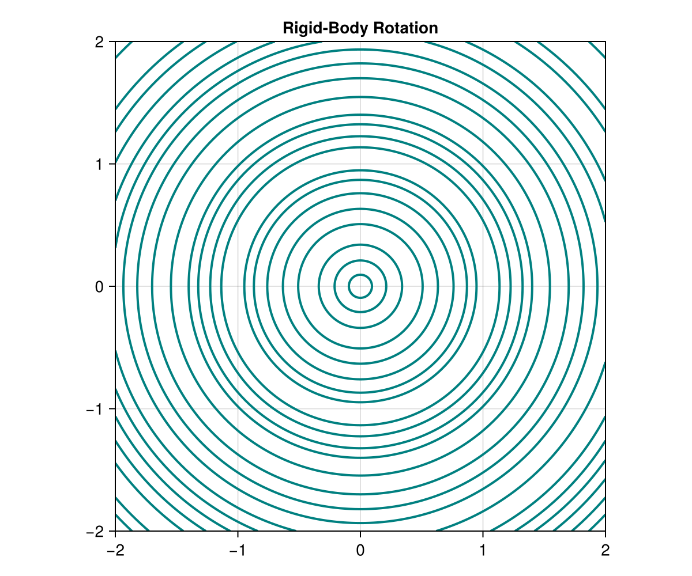
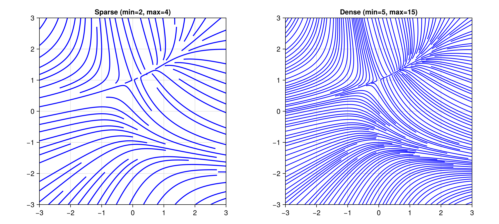
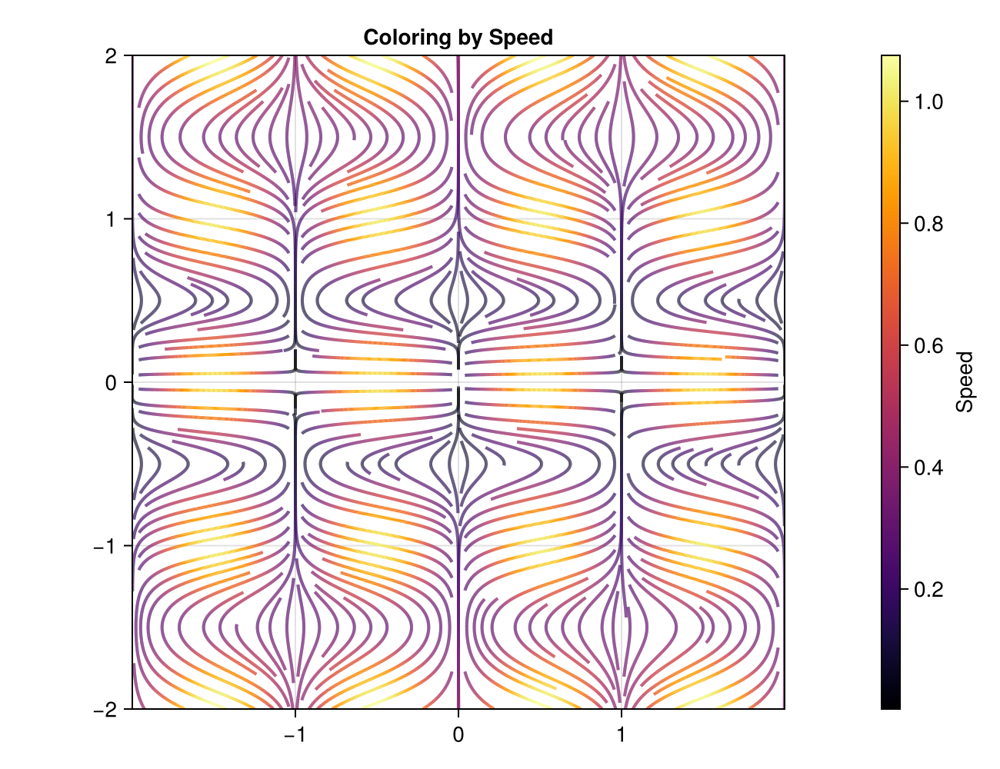
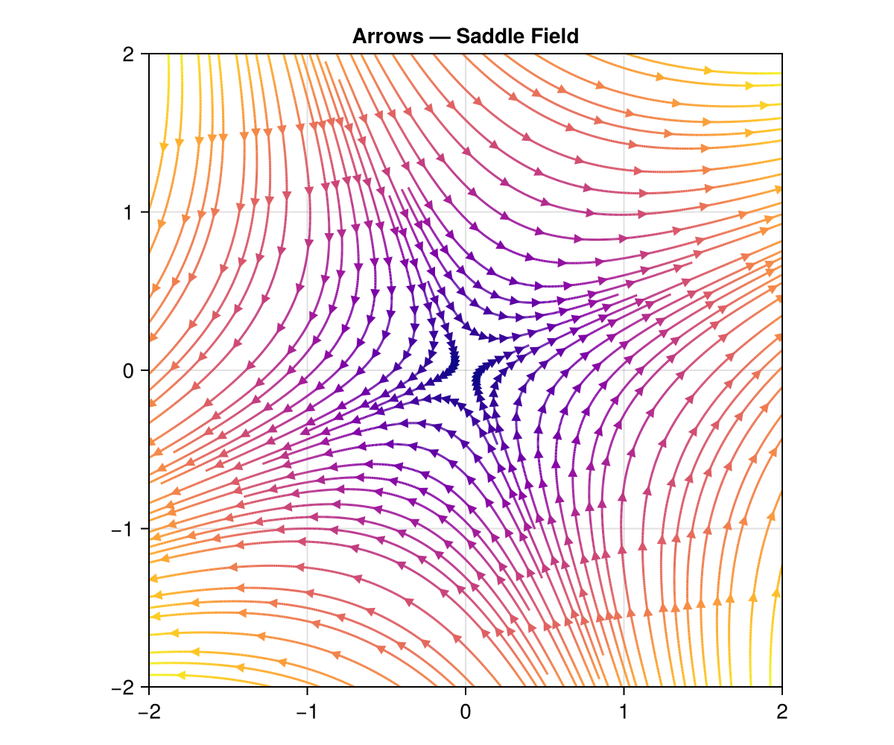
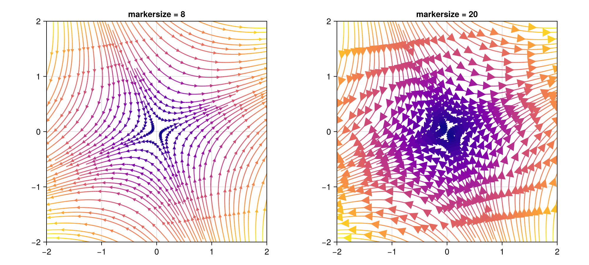
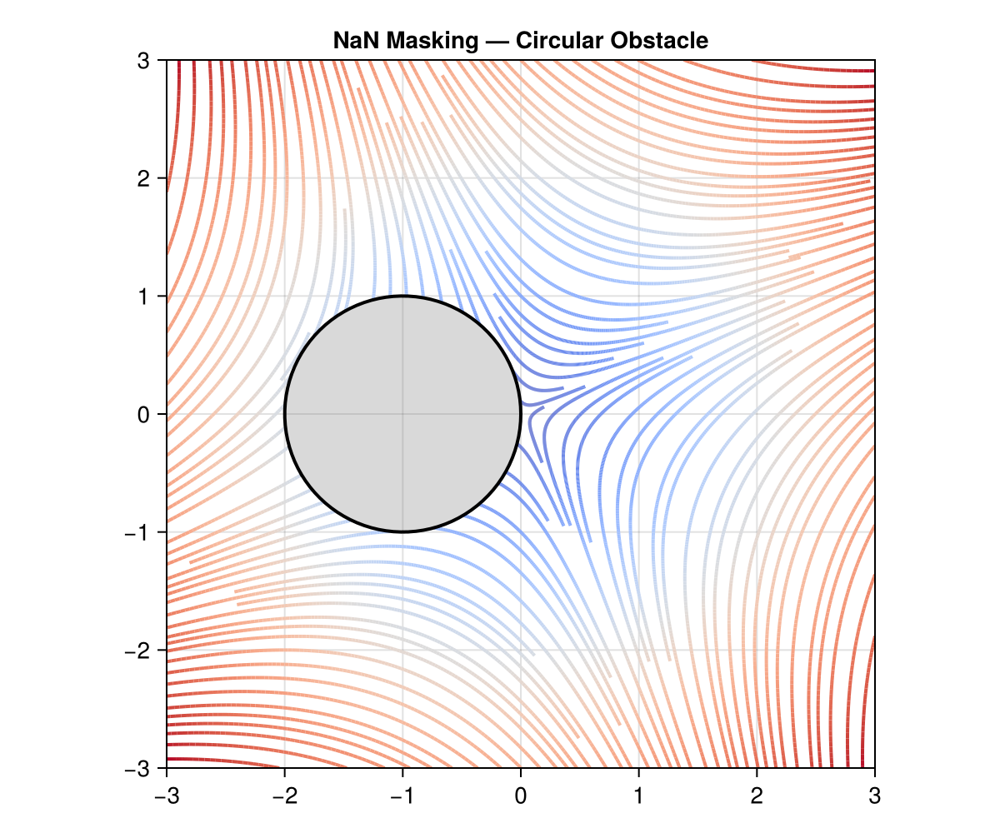
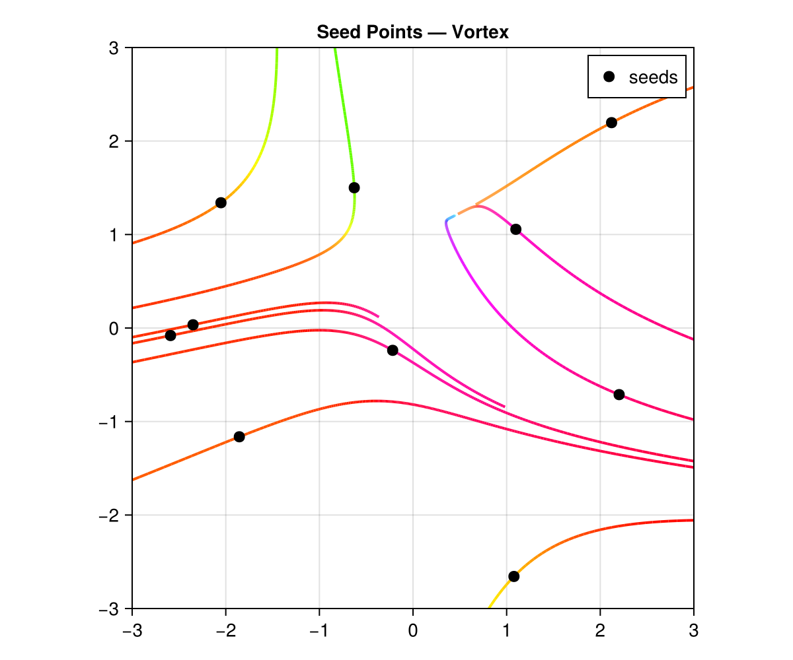
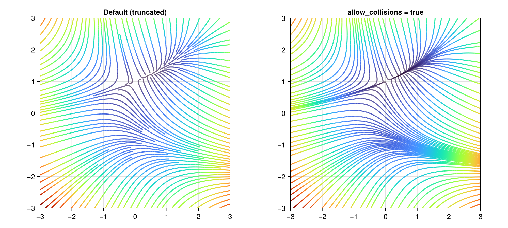
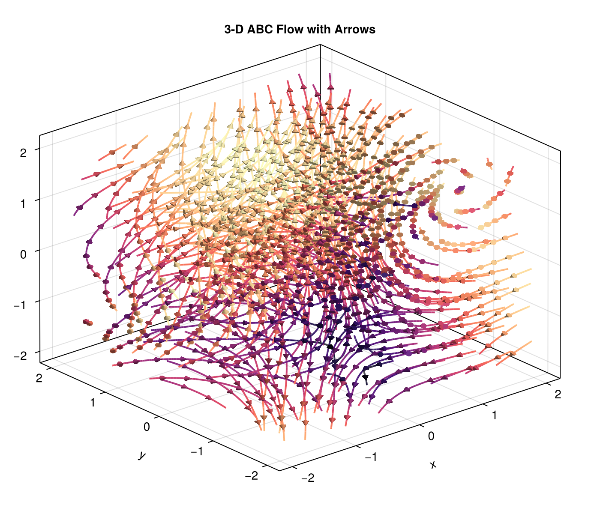

```@meta
CurrentModule = UniformStreamlines
```

# UniformStreamlines.jl

**Evenly-spaced streamlines for 2-D, 3-D, and N-D vector fields in Julia.**

UniformStreamlines.jl implements the Jobard–Lefer algorithm to produce streamlines that are uniformly distributed across a domain — no clumps, no gaps. It works with function-defined or grid-defined velocity fields and supports Plots.jl and Makie.jl for visualization.

## Installation

```julia
using Pkg
Pkg.add("UniformStreamlines")
```

## Quick Start

```julia
using UniformStreamlines

xs = LinRange(-2, 2, 200)
ys = LinRange(-2, 2, 200)

str = stream(xs, ys, (x, y) -> -y, (x, y) -> x)
```

Plot with Plots.jl:

```julia
using Plots
streamlines(str)
```

Or with Makie:

```julia
using CairoMakie
streamlines(str)
```



## Features

### Function or Matrix Input

Pass velocity components as functions or pre-computed arrays:

```julia
# Functions
str = stream(xs, ys, (x, y) -> -y, (x, y) -> x)

# Matrices (U[i,j] is the x-velocity at (xs[i], ys[j]))
U = [-y for x in xs, y in ys]
V = [ x for x in xs, y in ys]
str = stream(xs, ys, U, V)
```

### Density Control

Adjust `min_density` and `max_density` to control how tightly streamlines are packed:

```julia
xs = LinRange(-3, 3, 200)
ys = LinRange(-3, 3, 200)

# Sparse
str_sparse = stream(xs, ys, (x, y) -> -1 - x^2 + y, (x, y) -> 1 + x - y^2;
                    min_density=2, max_density=4)

# Dense
str_dense = stream(xs, ys, (x, y) -> -1 - x^2 + y, (x, y) -> 1 + x - y^2;
                   min_density=5, max_density=15)
```

Both parameters are unitless multipliers that scale an internal base grid of 10 cells per axis:

- **`min_density`** (default `3`) — Controls the *seeding grid*. The domain is divided into `10 × min_density` cells per axis. One candidate seed point is placed per cell, so a higher value means more candidate starting points and denser coverage.
- **`max_density`** (default `10`) — Controls the *collision-detection grid*. The domain is divided into `10 × max_density` cells per axis. When a streamline is being integrated, it checks this finer grid to decide whether it is too close to an existing streamline. A higher value allows streamlines to pass closer together before being truncated.

The ratio `max_density / min_density` determines how much room there is between the minimum spacing (set by the collision grid) and the seeding spacing. Typical values:

| Style  | `min_density` | `max_density` |
|:-------|:--------------|:--------------|
| Sparse | 2             | 4             |
| Normal | 3 (default)   | 10 (default)  |
| Dense  | 5–8           | 15–30         |



### Coloring

Use `colorize` to compute a per-point scalar for color-mapping:

```julia
str = stream(xs, ys, (x, y) -> sin(π*x) * cos(π*y), (x, y) -> 0.2y)
c = colorize(str, :norm)
```

Built-in color symbols: `:norm`, `:vx`, `:vy`, `:vz`, `:x`, `:y`, `:z`.

You can also pass a custom function `(position, velocity) -> scalar`:

```julia
c = colorize(str, (p, v) -> p[1]^2 + p[2]^2)   # distance² from origin
```

With Plots.jl, pass the color array via `line_z`:

```julia
using Plots
streamlines(str; line_z=c, color=:viridis)
```



### Arrows

Add directional arrows along streamlines:

```julia
# Plots.jl
streamlines(str; with_arrows=true, arrows_every=20, arrow_scale=0.5)

# Makie
streamlines(str; with_arrows=true, arrows_every=20)
```



Control arrow size with `markersize` (Makie) or `arrow_scale` (Plots.jl):

```julia
# Makie — small vs large arrows
streamlines(str; with_arrows=true, arrows_every=20, markersize=8)   # small
streamlines(str; with_arrows=true, arrows_every=20, markersize=20)  # large

# Plots.jl
streamlines(str; with_arrows=true, arrows_every=20, arrow_scale=0.5)  # half size
streamlines(str; with_arrows=true, arrows_every=20, arrow_scale=2.0)  # double size
```



### NaN Masking

Return `NaN` from velocity functions to mask out regions of the domain. Streamlines will not enter or cross masked areas:

```julia
u(x, y) = (x+1)^2 + y^2 < 1 ? NaN : x + y
v(x, y) = (x+1)^2 + y^2 < 1 ? NaN : x - y

str = stream(xs, ys, u, v)
```



### Seed Points

Provide explicit seed points to control where streamlines originate:

```julia
seed_x = [-1.0, 0.0, 1.0]
seed_y = [ 0.0, 0.0, 0.0]
str = stream(xs, ys, (x, y) -> x + y, (x, y) -> x - y; seeds=(seed_x, seed_y))
```



### Unbroken Streamlines

By default, streamlines are truncated when they approach an existing streamline. Set `allow_collisions=true` to let them pass through each other:

```julia
str = stream(xs, ys, (x, y) -> -y / (x^2 + y^2 + 0.1),
                     (x, y) ->  x / (x^2 + y^2 + 0.1);
             allow_collisions=true)
```



### 3-D Streamlines

The same interface extends to three dimensions:

```julia
xs = LinRange(-2, 2, 50)
ys = LinRange(-2, 2, 50)
zs = LinRange(-2, 2, 50)

str3 = stream(xs, ys, zs,
              (x, y, z) -> -y,
              (x, y, z) ->  x,
              (x, y, z) ->  0.3z)
```

A more interesting example — the Arnold–Beltrami–Childress (ABC) flow with directional arrows:

```julia
A, B, C = 1.0, √2, √3
str3 = stream(xs, ys, zs,
              (x, y, z) -> A * sin(z) + C * cos(y),
              (x, y, z) -> B * sin(x) + A * cos(z),
              (x, y, z) -> C * sin(y) + B * cos(x);
              min_density=2, max_density=4)
c3 = colorize(str3, :norm)

using GLMakie
streamlines(str3; color=c3, colormap=:magma,
            with_arrows=true, arrows_every=25, markersize=0.12)
```



### N-D Streamlines

For arbitrary dimensions, use the tuple form:

```julia
axs = (LinRange(-2, 2, 50), LinRange(-2, 2, 50), LinRange(-2, 2, 50), LinRange(-2, 2, 50))
fns = ((x, y, z, t) -> -y, (x, y, z, t) -> x, (x, y, z, t) -> z, (x, y, z, t) -> -t)
str4 = stream(axs, fns)
```

### Calling Conventions

`stream` supports two equivalent calling styles:

**Flat form** — pass axes and velocity components as separate positional arguments. This is the most convenient syntax for 2-D and 3-D fields:

```julia
# 2-D with functions
str = stream(xs, ys, (x, y) -> -y, (x, y) -> x)

# 2-D with matrices
str = stream(xs, ys, U, V)

# 3-D with functions
str = stream(xs, ys, zs, (x,y,z) -> -y, (x,y,z) -> x, (x,y,z) -> 0.3z)

# 3-D with matrices
str = stream(xs, ys, zs, U, V, W)
```

**Tuple form** — pass axes as a tuple and velocity components as a tuple. This is the general N-D interface, but works in any dimension:

```julia
# 2-D (tuple form)
str = stream((xs, ys), ((x,y) -> -y, (x,y) -> x))

# 3-D (tuple form)
str = stream((xs, ys, zs), ((x,y,z) -> -y, (x,y,z) -> x, (x,y,z) -> 0.3z))

# 4-D
str = stream((xs, ys, zs, ts), (f1, f2, f3, f4))

# With pre-computed arrays
str = stream((xs, ys), (U, V))
```

Both forms accept the same keyword arguments (`min_density`, `max_density`, `seeds`, `allow_collisions`, etc.). The flat form is simply a convenience wrapper that forwards to the tuple form internally.

## API Summary

| Function | Description |
|:---------|:------------|
| `stream` | Compute evenly-spaced streamlines |
| `colorize` | Compute per-point color values |
| `streamarrows` | Extract arrow glyphs for visualization |
| `streamlines` / `streamlines!` | Plot recipe (Plots.jl or Makie) |

### Keyword arguments to `stream`

| Keyword | Default | Description |
|:--------|:--------|:------------|
| `min_density` | `3` | Coarse grid density for seeding |
| `max_density` | `10` | Fine grid density for collision detection |
| `seeds` | `nothing` | Explicit seed points |
| `min_length` | `2` | Discard streamlines shorter than this |
| `allow_collisions` | `false` | Allow streamlines to cross each other |
| `stepsize` | adaptive | Integration step size |

### Keyword arguments for Plots.jl recipe

| Keyword | Default | Description |
|:--------|:--------|:------------|
| `with_arrows` | `false` | Show directional arrowheads |
| `arrows_every` | `10` | Place an arrow every N vertices |
| `arrow_scale` | `1.0` | Scale factor for arrow size |
| `line_z` | — | Per-point color values from `colorize` |

### Keyword arguments for Makie recipe

| Keyword | Default | Description |
|:--------|:--------|:------------|
| `with_arrows` | `false` | Show directional arrowheads |
| `arrows_every` | `10` | Place an arrow every N vertices |
| `markersize` | `12` (2-D) / `0.08` (3-D) | Size of arrowhead markers |
| `color` | `:blue` | Line / arrowhead color or per-point vector from `colorize` |
| `linewidth` | inherited | Width of streamlines |
| `colormap` | — | Colormap for color-mapped data |

